# LIEN

> Tie your loans. A composable hook framework for Marginfi v2, Kamino Lend, and Solend lifecycle events on Solana.

[](https://liens.fi)
[](https://liens.fi/docs)
[](https://x.com/liens_fi)
[](#)
[](LICENSE)
[](https://www.anchor-lang.com)
[](https://www.rust-lang.org)
[](https://www.typescriptlang.org)
[](https://solana.com)
[](https://explorer.solana.com/address/5yNMqcyZsGQJk4xvw4jjvoRBSnGs8mgramEa3HQe5faD?cluster=devnet)

## Live

| Resource | Value |
|---------|-------|
| Site | [liens.fi](https://liens.fi) |
| Executor program (devnet) | `5yNMqcyZsGQJk4xvw4jjvoRBSnGs8mgramEa3HQe5faD` |
| Initial deploy tx | [`3MSW…dG4j`](https://explorer.solana.com/tx/3MSWvHsCqZ2aUTQeyqwEBAAUr8zeH2vUtGLM6HfLRjYgSxwRKwro4UyDGrQX7jgAfkja437mFs4Lk8RiyWKYdG4j?cluster=devnet) |
| IDL | [`idl/lien_hook_executor.json`](idl/lien_hook_executor.json) |
| Anchor | 0.31.1 |
| Mainnet | not deployed yet — operator-driven via `lien deploy --cluster mainnet` |

LIEN is a Solana-first hook framework for lending: an Anchor 0.31 executor program plus a runtime, three adapters (Marginfi v2, Kamino Lend, Solend), a six-hook standard library, an SDK, a CLI, and a VS Code extension. Pool operators bind a list of hooks (a Composition) to a pool and the on-chain executor runs them at every lifecycle event.

The metaphor is rigging: each rope is a hook, each knot is a Composition. Tie carefully, retie at any time.

## Why LIEN exists

Marginfi, Kamino, and Solend are excellent lending protocols. None of them let an operator bring custom rules to a pool without forking the entire program. LIEN sits between the lending protocol and the user so the same audited contract can be specialised — dynamically tightening LTV under volatility, restricting borrowers to a KYC allowlist, defending liquidations against MEV searchers, hedging into Drift on collateral drawdowns, pricing rate against on-chain repayment reputation — without anyone having to fork the underlying lender.

The lifecycle model is inspired by Uniswap v4 hooks (Adams et al., 2024) and Aave v3's isolation / eMode features. The CPI plumbing draws on Token-2022 Transfer Hooks. Lien adapts those patterns to Solana's account model and to lending semantics.

## Architecture

```mermaid
%%{init: { "theme": "base", "themeVariables": {
  "primaryColor": "#3D2817",
  "primaryTextColor": "#F0EAD6",
  "primaryBorderColor": "#D4AF37",
  "lineColor": "#D4AF37",
  "fontFamily": "Space Mono, monospace",
  "tertiaryColor": "#5C3A1E"
}} }%%
flowchart LR
    user([Borrower])
    pool([Marginfi / Kamino / Solend])
    adapter[[Lien adapter]]
    runtime[[Lien runtime]]
    exec{{Anchor executor<br/>on-chain}}
    composition[(Composition PDA)]
    hooks([Six standard hooks])
    drift([Drift v2])

    user -- deposit / borrow / repay --> pool
    pool -- lifecycle event --> adapter
    adapter -- normalise --> runtime
    runtime -- run_composition CPI --> exec
    exec -- read PDA --> composition
    composition -- entries --> hooks
    hooks -- accept / reject / side effect --> exec
    exec -- decision --> adapter
    adapter -- emit instruction --> drift
```



## The six standard knots

| Hook | Knot | Lifecycle | One line |
|------|------|----------|---------|
| `DynamicLTV` | slip | beforeBorrow, afterDeposit | Tightens max LTV as realised volatility climbs. |
| `TimeTriggerLiq` | timer hitch | beforeLiquidate | Bounds liquidations to operator windows; delays under stale oracle. |
| `WhitelistBorrow` | lock | beforeBorrow | Restricts new debt to a registered allowlist. |
| `AntiMEVLiq` | double bowline | beforeLiquidate | Delays liquidations and (optionally) reserves them for known keepers. |
| `AutoHedge` | double helix | afterBorrow, afterDeposit | Opens a Drift perp short when collateral crosses a trigger band. |
| `ReputationRate` | rolling hitch | beforeBorrow | Discounts borrow rate against on-chain repayment reputation. |

Each is a small Rust crate under `packages/hook-library`. They are wired through the runtime in `packages/hook-runtime` and registered with the executor program in `packages/anchor-program`.

## Repository layout

```
packages/
  hook-runtime/       Rust crate — lifecycle types, Composition + Simulator, ReputationProvider trait
  anchor-program/     Anchor 0.31 program lien-hook-executor (Pool, Composition, HookListing PDAs)
  hook-library/       Six standard hooks (slip, timer, lock, bowline, helix, rolling)
  marginfi-adapter/   Marginfi v2 client wrapper -> normalised LifecycleEvent
  kamino-adapter/     Kamino Lend market loader -> normalised LifecycleEvent
  solend-adapter/     Solend SDK wrapper -> normalised LifecycleEvent
  sdk-ts/             TypeScript SDK — Composition builder, ExecutorClient, browser simulator
  cli/                @liens/cli — create, list, simulate, deploy plan, GitHub Action scaffold
  vscode-extension/   VS Code extension — knot diagram, inline simulation, deploy plan
apps/
  web/                Next.js 14 + Three.js workshop landing, Hook Designer, Marketplace, Docs
  explorer/           On-chain explorer for compositions and listings
docs/
  architecture.md     The runtime / executor / adapter rings
  hooks-spec.md       Lifecycle events, flags bitmap, side-effect ABI
  security.md         Audit scope, mainnet deploy gates, listing manifest checks
```

## Quick start

```bash
git clone https://github.com/liens-fi/lien
cd lien
pnpm install
pnpm dev          # serve apps/web
cargo build       # build the Rust crates
anchor build      # build the Anchor program
```

### Use the SDK

```ts
import {
  Composition,
  dynamicLtv,
  antiMevLiq,
  simulate,
} from "@liens/sdk";

const composition = new Composition()
  .add(dynamicLtv({
    programId: "HookDLTV1111111111111111111111111111111111",
    priority: 10,
    baseLtvBps: 7_500,
    sensitivity: 50,
    volFloorBps: 1_000,
    minLtvBps: 2_500,
  }))
  .add(antiMevLiq({
    programId: "HookAMEV1111111111111111111111111111111111",
    priority: 20,
    minDelaySlots: 3,
  }));

const report = simulate(composition, events); // events: LifecycleEvent[]
console.log(report.ltvOverrides, report.liquidationsDelayed);
```

### Use the CLI

```bash
npm i -g @liens/cli
lien list
lien simulate --pool SOL-USDC --steps 240
lien create hook --name MyKnot --lifecycle BeforeBorrow
lien action          # write .github/workflows/lien-hook-ci.yml
lien deploy --cluster mainnet   # prints the deploy plan; does not broadcast
```

## On-chain executor

The executor lives in `packages/anchor-program/programs/lien-hook-executor`. It exposes four instructions:

- `register_pool(adapter, bump)` — register a Marginfi/Kamino/Solend market.
- `install_composition(slot_index, entries)` — write a Composition PDA.
- `update_composition(entries)` — replace a Composition's hook list.
- `run_composition(event_kind, position_owner, adapter, payload)` — invoked by the adapter on every lifecycle event.
- `publish_hook(flags, manifest_uri, bump)` — list a hook program for marketplace discovery.

Composition PDAs store up to eight hook entries (`hook_program`, `priority`, `flags`). The executor emits `CompositionExecuted` events that downstream indexers consume.

## License

Apache-2.0.
